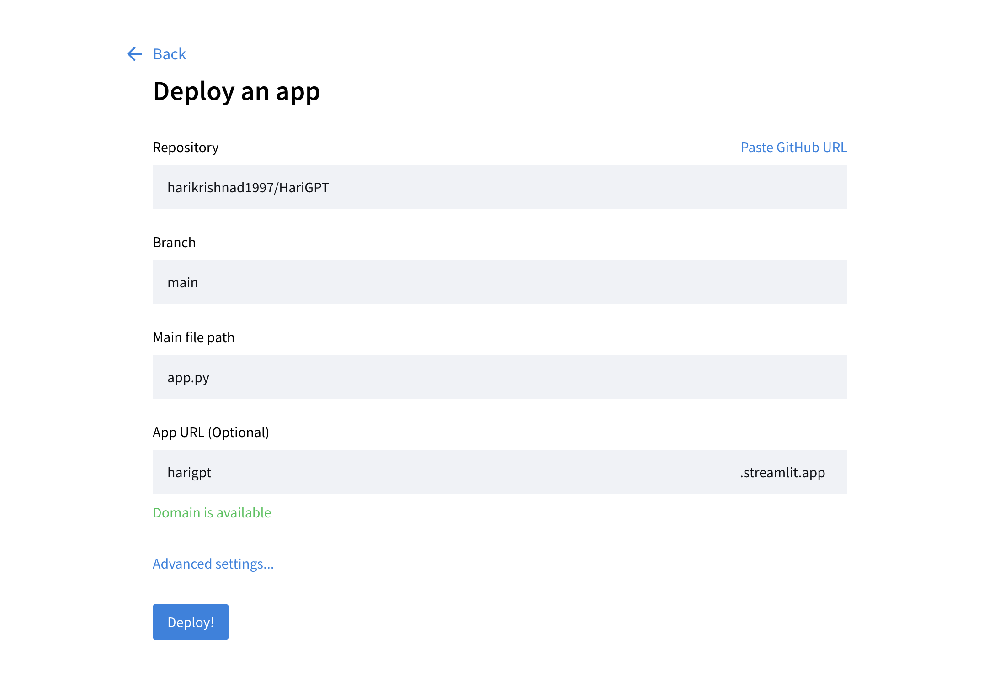
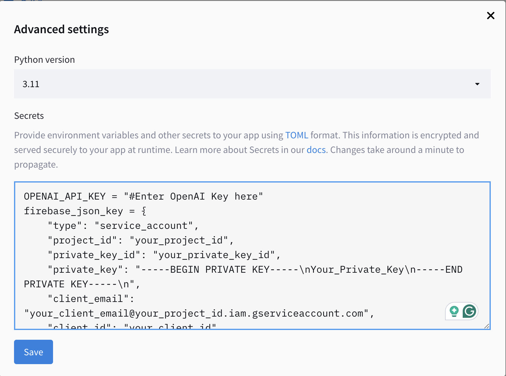

# HariGPT - Harikrishna's Resume Bot

## Overview

This Streamlit application serves as a chatbot, providing information about Harikrishna (Harry) Dev's professional background and qualifications. The chatbot is powered by large language models and can answer questions based on the provided context, which includes Harikrishna's resume and additional data.

## Features

- Provides information about Harikrishna's educational background, professional experience, and skills
- Allows users to ask questions and receive relevant responses
- Stores conversation history in a Cloud Firebase database for further analysis
- Supports both CSV and PDF (resume) data sources

## Link

Resume Bot Website : [harikrishnad1997-resume-bot.hf.space](https://harikrishnad1997-resume-bot.hf.space/)

## Demo


## Prerequisites

- Python 3.9 or higher
- OpenAI API key
- Cloud Firebase project

## Installation

1. Fork my repository and change the name to your desired name
2. Clone the repository:

```
git clone https://github.com/{username}/{yourGPT}.git && cd yourGPT
```

2. Install the required dependencies:

```
pip install -r requirements.txt
```

3. Update the following files:
   * Replace all instance of the name `Harikrishna Dev` or `Harry` with your name and nickname in the following files:
     * `app.py`
     * ``templates/template.json``
   * Change the following in the `data` folder
     * `Resume.pdf`
     * `about_me.csv` with relevant questions about you
4. Set up the environment variables:
   - Create a `.toml file with the OPENAI key and the FireBase JSON key inputted (During the development process)`
5. Run the `eda.ipynb` notebook to update your FAISS indexes

## Usage

1. Run the Streamlit application:

```
streamlit run app.py
```

2. The application will open in your default web browser.
3. Ask questions about your background and qualifications, and the chatbot will provide relevant responses.

## Publishing your app

1. Once you commit all your files to **GitHub**, create an account in [**Streamlit.io** ](https://share.streamlit.io/)preferably with your GitHub account.
2. Click on the `New app` option and input as follows:

   
3. Input your `OPENAI_API_KEY` and `firebase_json_key` using the **Advanced settings...** option

   
4. Click on **Deploy** button

### Note

You can also deploy the same on **[HuggingFace Spaces](https://huggingface.co/spaces)**. You can find more documentation on the same [here](https://huggingface.co/docs/hub/en/spaces-sdks-streamlit).

## Configuration

- The application uses a FAISS index to store the CSV and PDF data embeddings. If the index file (`faiss_index`) does not exist, it will be created automatically.
- The CSV data file path is set in the `data_source` variable, and the PDF resume file path is set in the `pdf_source` variable.
- The Cloud FireStone connection details are set using the environment secrets `firebase_key`.

## Acknowledgements

This project is highly influence by the Repository created by [Art Kreimer](https://github.com/kredar) and is dependent on the following libraries and tools:

- [Streamlit](https://streamlit.io/) for building the web application
- [LangChain](https://langchain.com/) for integrating the language model and retrieval chain
- [OpenAI API](https://openai.com/) for the language model
- [FAISS](https://github.com/facebookresearch/faiss) for the vector database
- [Firebase](https://firebase.google.com/) for storing the conversation history

## License

This project is licensed under the [MIT License](LICENSE).
